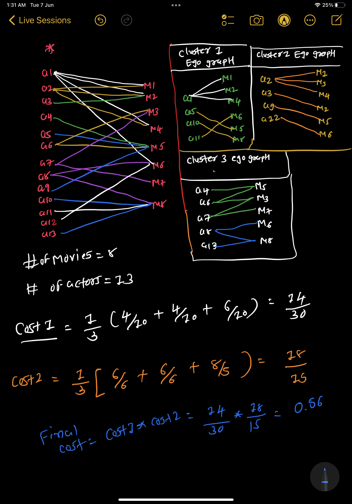
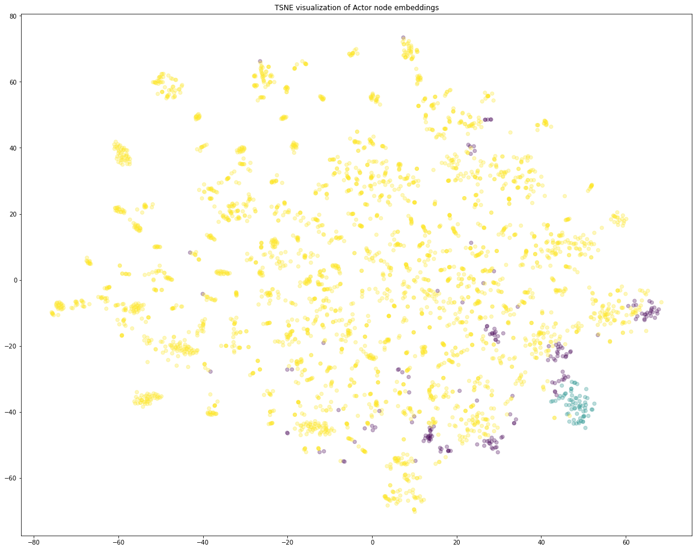
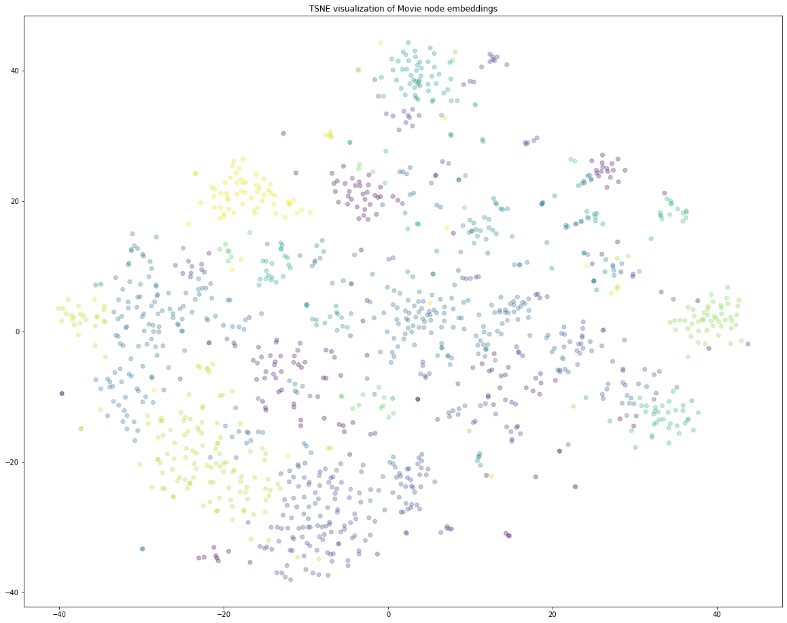

# Clustering-on-Movies-and-Actors

* Given data of Actor and movies in which actor acted, We wanted to **group similar movies together** and **group similar Actors together**
* We will form this as a **graph problem**, We will build **[bipartite Graph](https://en.wikipedia.org/wiki/Bipartite_graph)** from **sets of actors and sets of movies**, and use graph algorithms to form implicit embeddings  for every node ( movies and actors )
* We will then user **clustering** methods to **cluster similar movies and actors**

## Solution Approach

1.  Formulate problem as graph problem, we have two different sets of nodes. one for movies and second for actors, so we will use **bipartite graph**

2. Generate Node Embedding using [Representation Learning](https://stellargraph.readthedocs.io/en/stable/demos/embeddings/metapath2vec-embeddings.html?highlight=UniformRandomMetaPathWalk)

 * We will use  random walks to get embeddings for all the movies and actors, we will user [metapath2Vec](https://ericdongyx.github.io/papers/KDD17-dong-chawla-swami-metapath2vec.pdf) algorithm
 ## Metapath2Vec algorithm
 The Metapath2Vec algorithm introduced in  [metapath2Vec](https://ericdongyx.github.io/papers/KDD17-dong-chawla-swami-metapath2vec.pdf)  is a 2-step representation learning algorithm. The two steps are:

 1. Use **uniform random walks**  to generate **sentences from a graph**. A sentence is a list of node IDs. The **set** of all sentences makes a **corpus**. The **random walk** is driven by a metapath that defines the **node type order by which the random walker explores the graph**.

 2. The corpus is then used to learn an embedding vector for each node in the graph. Each node ID is considered a unique word/token in a dictionary that has size equal to the number of nodes in the graph. The **Word2Vec** algorithm is used for **calculating the embedding vectors.**
 * Two possible Random Walk Model 
     1. [ Movie, Actor, Movie ]
     2. [ Actor, Movie, Actor ]
 * We will do **100 random walks** and use randomwalks to **generate embedding using genism** 

# Applying clustering algorithm to group similar actors

### Flow of Algorithm
 
 1. Get all the actor nodes, and get actor embeddings
 2. Apply  clustering algorithm like AgglomerativeClustering, and Kmeans 
 3. Choose the number of clusters for which  maximum score of <b>$Cost1*Cost2$</b> 
 4. Cost1 = %7D%7D%7B%5Ctext%7B(total%20number%20of%20nodes%20in%20that%20cluster%20i)%7D%7D)   where N= number of clusters 
 
    
    Cost 1 is maximize when all the actors are connected to each other, and they form largest connected component with dense graph.
 5. Cost2 = %7D%7D%7B%5Ctext%7B(number%20of%20unique%20movie%20nodes%20in%20the%20graph%20with%20the%20actor%20nodes%20and%20its%20movie%20neighbours%20in%20cluster%20i)%7D%7D) where N= number of clusters 
   
    Cost 2 is maximize when actors are connected to every other movies, more the actors are connected to more movies and more movies connected to more actors form a dense cluster.
 6. Fit the clustering algorithm with the opimal number_of_clusters and get the cluster number for each node  
 7. Convert the d-dimensional dense vectors of nodes into 2-dimensional using dimensionality reduction techniques ( TSNE) 
 8. Plot the 2d scatter plot, with the node vectors after step 7  and give colors to nodes such that same cluster nodes will have same color

    for number_of_clusters in [3, 5, 10, 30, 50, 100, 200, 500]:
		algo = clustering_algorith(clusters=number_of_clusters)
        
        # you will be passing a matrix of size N*d 
        # where N number of actor nodes and d is dimension from gensim
		
        algo.fit(the dense vectors of actor nodes) 
        
        #You can get the labels for corresponding actor nodes (algo.labels_)
        #Create a graph for every cluster(ie., if n_clusters=3, create 3 graphs)
        (You can use ego_graph to create subgraph from the actual graph)
        compute cost1,cost2 
           (if n_cluster=3, cost1=cost1(graph1)+cost1(graph2)+cost1(graph3) # here we are doing summation
            cost2=cost2(graph1)+cost2(graph2)+cost2(graph3)
		computer the metric Cost = Cost1*Cost2
	return number_of_clusters which have maximum Cost

### Cost 1 and Cost 2 rough work

### Clustering Result for Grouping similar Actors

| Clustering Method       | no of cluster | cost        |
| ----------------------- | ------------- | ----------- |
| AgglomerativeClustering | 3             | 3.921742357 |
| KMeans                  | 3             | 3.696554334 |
| AgglomerativeClustering | 5             | 2.900189835 |
| KMeans                  | 5             | 2.884047912 |
| KMeans                  | 7             | 2.583752254 |
| AgglomerativeClustering | 7             | 2.541207708 |
| AgglomerativeClustering | 10            | 2.246406932 |
| KMeans                  | 10            | 2.20472405  |
| AgglomerativeClustering | 20            | 2.128346378 |
| AgglomerativeClustering | 200           | 2.116761654 |
| AgglomerativeClustering | 15            | 2.106809976 |
| AgglomerativeClustering | 500           | 2.101435191 |
| AgglomerativeClustering | 25            | 2.00551537  |
| KMeans                  | 15            | 1.977317111 |
| AgglomerativeClustering | 30            | 1.890698712 |
| KMeans                  | 500           | 1.885944087 |
| KMeans                  | 20            | 1.864328479 |
| KMeans                  | 200           | 1.767619081 |
| KMeans                  | 30            | 1.758672095 |
| KMeans                  | 25            | 1.720282174 |
| AgglomerativeClustering | 50            | 1.60247998  |
| AgglomerativeClustering | 100           | 1.595304077 |
| KMeans                  | 50            | 1.517051723 |
| KMeans                  | 100           | 1.449046075 |

## Visualize Actor clusters

# Applying clustering algorithm to group similar Movies

### Flow of Algorithm

1. Get all the movie nodes, and get movie embeddings
 2. Apply  clustering algorithm like AgglomerativeClustering, and Kmeans 
 3. Choose the number of clusters for which  maximum score of <b>$Cost1*Cost2$</b> 
 4. Cost1 = %7D%7D%7B%5Ctext%7B(total%20number%20of%20nodes%20in%20that%20cluster%20i)%7D%7D) where N= number of clusters  
) where N= number of clusters  
 5. Cost2 = %7D%7D%7B%5Ctext%7B(number%20of%20unique%20actor%20nodes%20in%20the%20graph%20with%20the%20movie%20nodes%20and%20its%20actor%20neighbours%20in%20cluster%20i)%7D%7D)
where N= number of clusters 
 
 6. Fit the clustering algorithm with the opimal number_of_clusters and get the cluster number for each node  
 7. Convert the d-dimensional dense vectors of nodes into 2-dimensional using dimensionality reduction techniques ( TSNE) 
 8. Plot the 2d scatter plot, with the node vectors after step 7  and give colors to nodes such that same cluster nodes will have same color

### Clustering Result for Grouping similar movies

| Clustering Method       | no of cluster | cost        |
| ----------------------- | ------------- | ----------- |
| AgglomerativeClustering | 50            | 14.30479542 |
| KMeans                  | 100           | 13.91774692 |
| AgglomerativeClustering | 100           | 13.557715   |
| KMeans                  | 30            | 13.4977687  |
| KMeans                  | 50            | 13.07082445 |
| KMeans                  | 200           | 12.72019123 |
| AgglomerativeClustering | 30            | 12.52828938 |
| AgglomerativeClustering | 200           | 12.41167839 |
| KMeans                  | 25            | 11.37323168 |
| KMeans                  | 15            | 11.03547218 |
| AgglomerativeClustering | 20            | 10.89731702 |
| KMeans                  | 20            | 10.83971441 |
| AgglomerativeClustering | 5             | 10.81933152 |
| AgglomerativeClustering | 25            | 10.62964062 |
| KMeans                  | 500           | 10.38436946 |
| AgglomerativeClustering | 500           | 10.30178991 |
| KMeans                  | 7             | 9.626998928 |
| AgglomerativeClustering | 7             | 9.53589177  |
| KMeans                  | 10            | 9.300160366 |
| AgglomerativeClustering | 3             | 9.299485713 |
| AgglomerativeClustering | 15            | 8.905799924 |
| AgglomerativeClustering | 10            | 8.880725213 |
| KMeans                  | 5             | 8.601141307 |
| KMeans                  | 3             | 8.356465399 |

## Visualize Movies clusters

